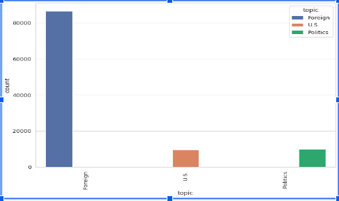
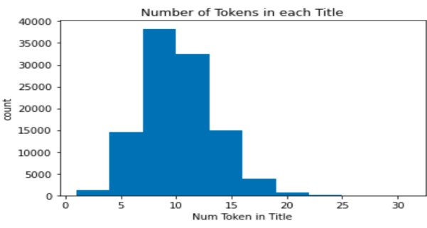
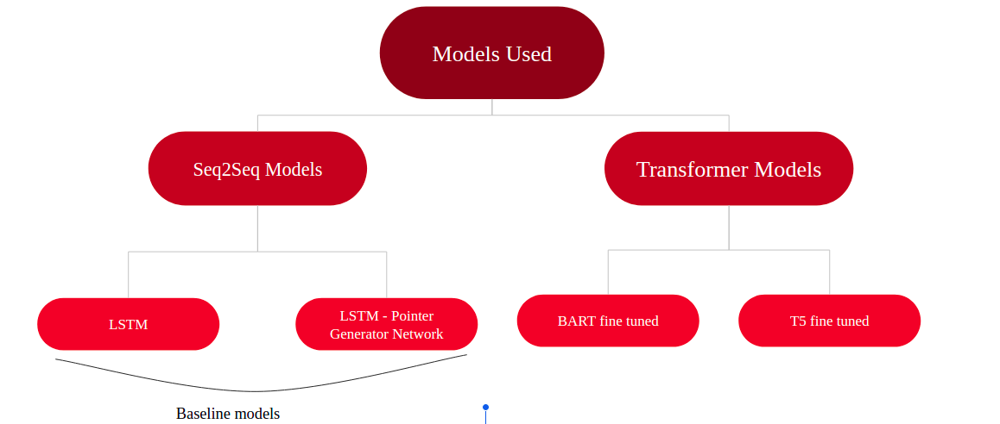
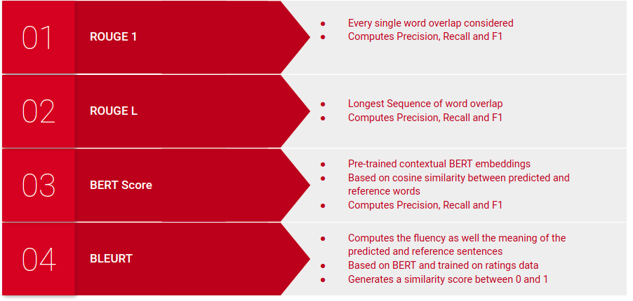
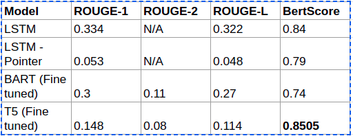

### CS525-NLP-Project

## Team Members: 
Anamika Kumari, Abhishek, David, Jeff

#AIM

The aim of the project was to do News Summarization & Title generation.

## Dataset
The dataset contain 
Dataset used for the Project was:
https://www.kaggle.com/brendanmiles/nyt-news-dataset-20082021

#The topic wise distribution.

    

#The title length variation across summaries.

    

## Models Implemented.

For this Use-case we have used LSTM as our baseline model & LSTM-Pointer Netwrok, BART & T5 as our fine tuned model.

The title length variation across summaries.

    

### Eval Metrics:

In this Project we have used Rouge, BertScore & Bleurt as our evaluation metric. Bleurt was strongly penalizing our result so we removed it later.

    

## Conclusion & Result

Comparison & analysis across models.

    

The model performed well on generating summary but did not perform well on producing catchy title & headlines.

